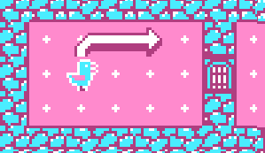
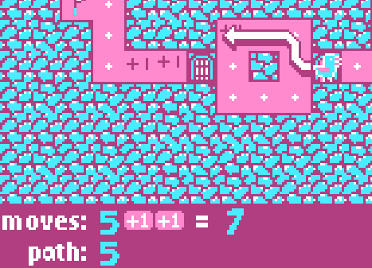

# [Mini Jam 183](https://itch.io/jam/mini-jam-183-calculations)
**theme:** calculations

**limitation:** 4 colours

**My Submission**: https://madcoretom.itch.io/pigeon-path

## Screnshots

## Theme : calculations

You have to take a certain number of steps to reach the goal.

if you stop on a door, it opens the door

if you step over a + or x2 your steps increase for this move

## Instructions

Controls:

* WASD or arrow keys to move around
* Enter, E or Z to make your move (your path needs to match the available moves exactly)
* Backspace, reset move
* To open a door, you must land on it on your last move
* To end the level, you must land on the flag on your last move
* To restart the level, press Escape
* Navigate the dungeon levels and get to the flag 

FAQ:

* *The arrow keys do nothing:* Click the game to focus on it
* *The arrow keys keep scrolling my window:* use WASD instead
* *WASD doesn't work:* is capslock on?
* *I'm stuck:* Hit Escape to restart
* *I lost my progress:* it doesn't save progress, but there aren't many levels

## Resources

* Big font based on https://www.dafont.com/bestime.font?text=0+1+2+3+4+5+6+7+8+9
* Small font based on https://www.dafont.com/dogica.font
## Other features I could add

* ✅ reset button, in case the palyer softlocks themselves
* Tiles you're not allowed to stop on (maybe there's no dot)
* ✅ Spash screen
* track the number of turns, and have a par
* imps that move left/right or up/down each turn
* Different palettes

## Item System idea

You can pick up an item as you pass over it

if you pick up a second item, the first one is dropped

you can use the item on tiles you end on

items
* hammer - breaks rocks
* key - opens door
* boat - can cross water
* sword - kills baddies
* shield - doesn't get hut by baddies
